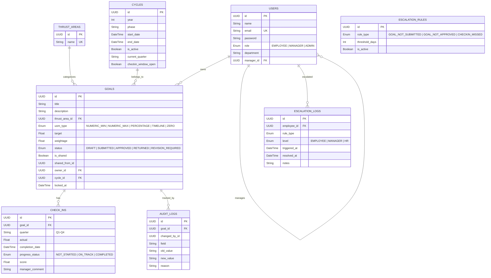
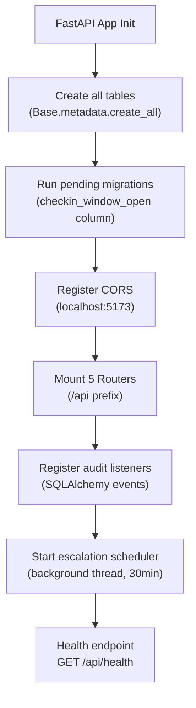
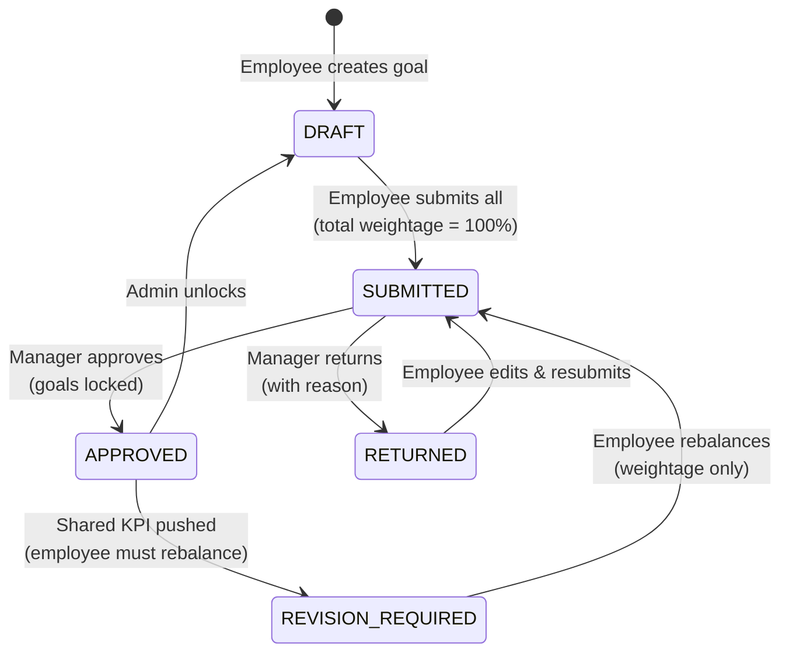
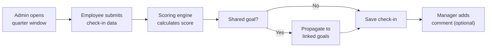
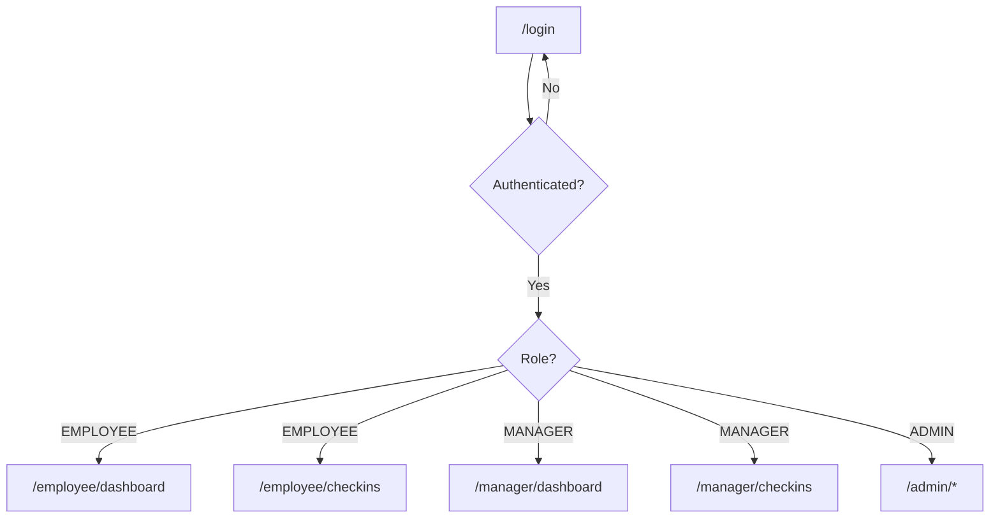
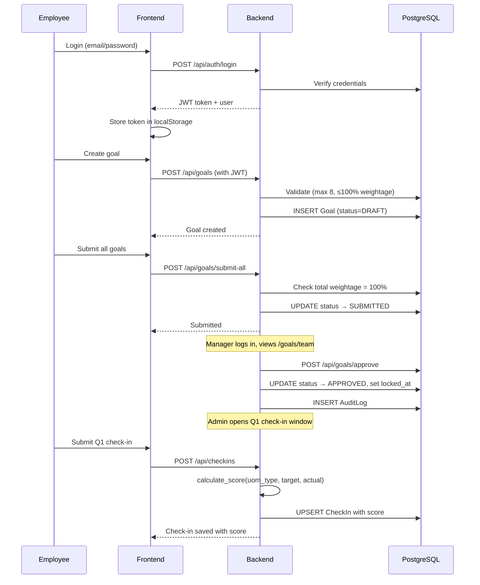

# AtomQuest — Codebase Walkthrough

## 1. Project Overview

**AtomQuest** is a full-stack **Goal Setting & Tracking Portal** with three role-based personas: **Employee**, **Manager**, and **Admin**. It follows a quarterly performance cycle where employees set goals, managers review/approve them, employees log check-ins against approved goals, and admins have full oversight with analytics, escalation management, and reporting.

| Layer | Tech Stack |
|-------|-----------|
| Backend | **FastAPI** (Python 3.x) + **SQLAlchemy** ORM + **PostgreSQL** |
| Frontend | **React 18** (Vite) + **React Router** + **Axios** |
| Auth | **JWT** (Bearer tokens via `python-jose`) + **bcrypt** |
| Styling | **Vanilla CSS** (55KB `index.css`) + TailwindCSS config present |
| Reports | **openpyxl** (Excel) + **CSV** streaming |
| Real-time | **SSE** (Server-Sent Events) for live completion tracking |

---

## 2. Directory Structure

```
atomquest/
├── backend/
│   ├── .env                          # DATABASE_URL, JWT_SECRET
│   ├── alembic.ini                   # Alembic migration config
│   ├── requirements.txt              # Python dependencies
│   ├── seed.py                       # Database seeder (users, thrust areas, cycle)
│   ├── test.py                       # Basic test file
│   ├── migrations/                   # Alembic migrations
│   └── app/
│       ├── main.py                   # FastAPI app entry point
│       ├── config.py                 # Pydantic Settings (env vars)
│       ├── database.py               # SQLAlchemy engine, session, Base
│       ├── dependencies.py           # Auth middleware (JWT decode, role guards)
│       ├── models/
│       │   └── models.py             # All SQLAlchemy models (7 tables)
│       ├── schemas/
│       │   └── schemas.py            # Pydantic request/response schemas
│       ├── routers/
│       │   ├── auth.py               # Login, /me
│       │   ├── goals.py              # CRUD goals, submit, approve, return, shared goals
│       │   ├── checkins.py           # Check-in CRUD, manager comments
│       │   ├── admin.py              # Dashboard, analytics, cycles, reports, users
│       │   └── escalation.py         # Escalation rules, logs, run, summary
│       └── services/
│           ├── auth_service.py       # bcrypt + JWT token creation
│           ├── scoring_engine.py     # Score calculation per UoM type
│           ├── audit_logger.py       # Manual + automatic audit trail
│           └── escalation_scheduler.py # Background thread (30-min interval)
│
├── frontend/
│   ├── index.html                    # Vite entry HTML
│   ├── package.json                  # React, React Router, Axios, Recharts
│   ├── vite.config.js                # Vite config
│   └── src/
│       ├── main.jsx                  # React DOM root + providers
│       ├── App.jsx                   # Route definitions
│       ├── App.css                   # App-level styles
│       ├── index.css                 # Global design system (55KB)
│       ├── api/
│       │   ├── axios.js              # Axios instance + interceptors
│       │   ├── goals.js              # Goal API calls
│       │   ├── checkins.js           # Check-in API calls
│       │   ├── manager.js            # Manager API calls
│       │   ├── admin.js              # Admin API calls
│       │   └── escalation.js         # Escalation API calls
│       ├── context/
│       │   ├── AuthContext.jsx        # Auth state management
│       │   └── ThemeContext.jsx       # Theme toggle
│       ├── components/
│       │   ├── AppShell.jsx           # Layout shell with navigation
│       │   ├── ProtectedRoute.jsx     # Role-based route guard
│       │   ├── ErrorBoundary.jsx      # Error boundary wrapper
│       │   ├── GoalCard.jsx           # Employee goal card
│       │   ├── GoalFormModal.jsx      # Goal create/edit modal
│       │   ├── GoalCheckInCard.jsx    # Check-in card per goal
│       │   ├── CheckInForm.jsx        # Check-in form
│       │   ├── EmployeeGoalCard.jsx   # Manager view of employee goals
│       │   ├── ManagerGoalRow.jsx     # Manager goal row
│       │   ├── ManagerCheckInRow.jsx  # Manager check-in row
│       │   ├── ConfirmDialog.jsx      # Confirmation modal
│       │   ├── ReturnReasonModal.jsx  # Return reason input
│       │   ├── CycleCountdown.jsx     # Cycle time remaining
│       │   ├── WeightageBar.jsx       # Visual weightage indicator
│       │   ├── ScoreBadge.jsx         # Score display badge
│       │   ├── OnboardingHints.jsx    # First-time user hints
│       │   ├── EmptyState.jsx         # Empty state illustrations
│       │   ├── Skeleton.jsx           # Loading skeleton
│       │   └── ui/Components.jsx      # Shared UI primitives
│       ├── pages/
│       │   ├── Login.jsx              # Login page
│       │   ├── employee/
│       │   │   ├── Dashboard.jsx      # Employee goal dashboard
│       │   │   └── CheckIns.jsx       # Employee check-in page
│       │   ├── manager/
│       │   │   ├── Dashboard.jsx      # Manager team goals view
│       │   │   └── CheckIns.jsx       # Manager team check-ins view
│       │   └── admin/
│       │       ├── Dashboard.jsx      # Admin dashboard (36KB — main hub)
│       │       ├── Analytics.jsx      # Analytics with charts
│       │       └── Escalation.jsx     # Escalation management
│       └── utils/
│           └── toast.js               # Toast notification utility
```

---

## 3. Database Schema (7 Tables)



> [!IMPORTANT]
> - **Self-referential relationship** on `User`: `manager_id` → `User.id` (enables org hierarchy)
> - **Compound unique constraint** on `CheckIn`: one check-in per (goal, quarter)
> - All primary keys are **UUID v4**

---

## 4. Backend Architecture

### 4.1 Application Bootstrap ([main.py](file:///c:/Users/BITPATNA/atomquest/backend/app/main.py))



### 4.2 Authentication Flow

| Step | Detail |
|------|--------|
| **Login** | `POST /api/auth/login` → verify bcrypt hash → issue JWT (8hr expiry) |
| **Token payload** | `{id, email, name, role, department, manager_id}` |
| **Middleware** | `HTTPBearer` extracts token → `get_current_user()` decodes & fetches user |
| **Role guards** | `require_role(RoleEnum.ADMIN)` — factory pattern, reusable dependency |

### 4.3 API Routes Summary

#### Auth (`/api/auth`)
| Method | Endpoint | Access | Description |
|--------|----------|--------|-------------|
| POST | `/login` | Public | Authenticate & get JWT |
| GET | `/me` | Any | Get current user profile |

#### Goals (`/api/goals`)
| Method | Endpoint | Access | Description |
|--------|----------|--------|-------------|
| GET | `/thrust-areas` | Any | List thrust areas |
| GET | `/cycle` | Any | Get active cycle |
| GET | `/my` | Employee | Get my goals |
| POST | `/` | Employee | Create goal (max 8, ≤100% total) |
| PUT | `/{id}` | Employee | Update goal |
| DELETE | `/{id}` | Employee | Delete draft/returned goal |
| POST | `/submit-all` | Employee | Submit all draft goals (requires 100% total) |
| GET | `/team` | Manager | Get team goals with stats |
| POST | `/team/shared-goals` | Manager | Push shared KPI to team |
| POST | `/approve` | Manager | Approve all submitted goals |
| POST | `/{id}/return` | Manager | Return goal with reason |
| PUT | `/{id}/manager-edit` | Manager | Edit submitted goal (target/weightage) |

#### Check-ins (`/api/checkins`)
| Method | Endpoint | Access | Description |
|--------|----------|--------|-------------|
| POST | `/` | Employee | Upsert check-in (with auto-scoring) |
| GET | `/my` | Employee | Get my approved goals + check-ins |
| GET | `/team` | Manager | Get team check-ins with overall scores |
| PUT | `/{id}/comment` | Manager | Add manager comment to check-in |

#### Admin (`/api/admin`)
| Method | Endpoint | Access | Description |
|--------|----------|--------|-------------|
| GET | `/completion` | Admin | Completion dashboard data |
| GET | `/analytics` | Admin | Full analytics (scores, heatmap, distributions) |
| GET | `/audit-logs` | Admin | Paginated audit trail |
| POST | `/goals/{id}/unlock` | Admin | Unlock approved goal → DRAFT |
| POST | `/shared-goals` | Admin | Push shared goal to employees |
| GET | `/reports/achievement` | Admin | Download Excel report |
| GET | `/reports/achievement/csv` | Admin | Download CSV report |
| GET | `/completion/stream` | Admin | SSE live completion stream |
| GET | `/cycles` | Admin | List all cycles |
| POST | `/cycles` | Admin | Create new cycle |
| POST | `/cycles/{id}/activate` | Admin | Activate a cycle |
| POST | `/cycles/{id}/open-quarter` | Admin | Open quarter check-in window |
| POST | `/cycles/{id}/toggle-window` | Admin | Toggle check-in window |
| POST | `/cycles/{id}/auto-schedule` | Admin | Auto-schedule per BRD |
| GET | `/users` | Admin | List all users with org info |
| PUT | `/users/{id}/manager` | Admin | Reassign reporting manager |
| GET | `/goals` | Admin | List all goals in active cycle |

#### Escalation (`/api/admin/escalation`)
| Method | Endpoint | Access | Description |
|--------|----------|--------|-------------|
| GET | `/rules` | Admin | List escalation rules |
| POST | `/rules/seed` | Admin | Seed default rules |
| PUT | `/rules/{type}` | Admin | Update rule threshold/active |
| POST | `/run` | Admin | Manual escalation check |
| GET | `/logs` | Admin | Get escalation logs (filterable) |
| POST | `/logs/{id}/resolve` | Admin | Resolve an escalation |
| GET | `/summary` | Admin | Escalation dashboard summary |

---

## 5. Core Business Services

### 5.1 Scoring Engine ([scoring_engine.py](file:///c:/Users/BITPATNA/atomquest/backend/app/services/scoring_engine.py))

Calculates check-in scores based on **Unit of Measure (UoM)** type:

| UoM Type | Formula | Score Range |
|----------|---------|-------------|
| `NUMERIC_MIN` | `(actual / target) × 100` | 0–200% |
| `NUMERIC_MAX` | `(target / actual) × 100` (lower is better) | 0–200% |
| `PERCENTAGE` | `(actual / target) × 100` | 0–200% |
| `TIMELINE` | `100` if on time; `-5 per day late` | 0–100% |
| `ZERO` | `100` if actual = 0; else `0` | 0 or 100 |

### 5.2 Audit Logger ([audit_logger.py](file:///c:/Users/BITPATNA/atomquest/backend/app/services/audit_logger.py))

- **Manual logging**: `log_change()` called explicitly in routers for status changes, approvals, returns
- **Automatic logging**: SQLAlchemy `before_update` event listener on `Goal` model — captures post-lock field changes with a system actor UUID

### 5.3 Escalation Scheduler ([escalation_scheduler.py](file:///c:/Users/BITPATNA/atomquest/backend/app/services/escalation_scheduler.py))

- Runs as a **daemon thread** every 30 minutes
- Checks 3 rule types:
  1. **GOAL_NOT_SUBMITTED** — employee hasn't submitted goals within X days of cycle start
  2. **GOAL_NOT_APPROVED** — manager hasn't approved submitted goals within X days
  3. **CHECKIN_MISSED** — no check-in logged for current quarter within X days
- Creates `EscalationLog` entries with auto-escalating levels: `EMPLOYEE → MANAGER → HR`
- Deduplication: won't create duplicate logs for same employee + rule type on same day

---

## 6. Core Business Workflow

### 6.1 Goal Lifecycle



### 6.2 Key Business Rules

| Rule | Detail |
|------|--------|
| Max goals per cycle | **8** |
| Min weightage per goal | **10%** |
| Total weightage to submit | **Exactly 100%** |
| Shared goals | Pushed by Manager/Admin → auto-APPROVED, locked; can trigger REVISION_REQUIRED |
| Check-in window | Admin-controlled per quarter (Q1–Q4); can be toggled or auto-scheduled |
| Check-in constraint | One check-in per goal per quarter (compound unique) |
| Shared KPI check-ins | Only the **primary owner** can enter actual values; propagated to linked goals |
| Goal editing | Only DRAFT or RETURNED goals; REVISION_REQUIRED allows weightage changes only |

### 6.3 Check-in Flow



---

## 7. Frontend Architecture

### 7.1 Routing & Access Control



- **ProtectedRoute** wraps each role-specific route, redirecting unauthorized users
- **AuthContext** manages JWT + user state via `localStorage`
- **Axios interceptor** auto-attaches Bearer token; 401 responses → auto-logout

### 7.2 API Layer Normalization

The frontend API layer in `src/api/` handles **snake_case → camelCase** field normalization for seamless usage:

```js
// Example: goal normalization
{
  uom_type → uomType,
  thrust_area → thrustArea,
  is_shared → isShared,
  check_ins → checkIns,
  completion_date → completionDate
}
```

### 7.3 Page Breakdown

| Page | Size | Key Features |
|------|------|-------------|
| **Login** | 10KB | Email/password form, role-based redirect |
| **Employee Dashboard** | 11KB | Goal cards, create/edit modal, submit all, weightage bar |
| **Employee CheckIns** | 3KB | Check-in form per approved goal per quarter |
| **Manager Dashboard** | 15KB | Team view, approve/return, inline edit, push shared goals |
| **Manager CheckIns** | 6KB | Team check-in review, add comments, overall scores |
| **Admin Dashboard** | 37KB | Completion tracker, cycle management, user org chart, goal oversight, shared goal push, audit logs, report download |
| **Admin Analytics** | 24KB | Charts (Recharts): score heatmap, thrust area dist, UoM dist, manager effectiveness, goal status dist |
| **Admin Escalation** | 29KB | Rule management, manual run, log viewer, resolve actions, summary cards |

### 7.4 Key Components

| Component | Purpose |
|-----------|---------|
| `AppShell` | Layout wrapper with navigation sidebar |
| `GoalFormModal` | Create/edit goal form with validation |
| `CheckInForm` | Quarter-specific check-in input |
| `EmployeeGoalCard` | Manager's view of an employee's goal |
| `ManagerCheckInRow` | Manager's view of a check-in with comment |
| `WeightageBar` | Visual progress bar showing total weightage |
| `ScoreBadge` | Color-coded score display |
| `CycleCountdown` | Time remaining in current cycle |
| `OnboardingHints` | First-time user guidance |
| `Skeleton` | Loading state placeholders |
| `ConfirmDialog` | Reusable confirmation modal |
| `ReturnReasonModal` | Manager return reason input |

---

## 8. Data Flow — End-to-End Example

### Employee Creates & Submits Goals → Manager Approves → Employee Checks In




### Frontend
- **Base URL**: `http://localhost:5000/api` (hardcoded in [axios.js](file:///c:/Users/BITPATNA/atomquest/frontend/src/api/axios.js))
- **Vite dev server**: `http://localhost:5173`
- **CORS origins**: Backend allows `localhost:5173` and `127.0.0.1:5173`

### Seed Data ([seed.py](file:///c:/Users/BITPATNA/atomquest/backend/seed.py))
| User | Email | Role | Password |
|------|-------|------|----------|
| Admin User | admin@atomquest.com | ADMIN | password123 |
| Priya Sharma | manager@atomquest.com | MANAGER | password123 |
| Rahul Verma | employee@atomquest.com | EMPLOYEE | password123 |
| Meera Patel | meera@atomquest.com | EMPLOYEE | password123 |

**Thrust Areas**: Revenue Growth, Cost Optimisation, Customer Satisfaction, Safety, People Development

---

## 10. Running the Application

```bash
# Backend (port 5000)
cd backend
pip install -r requirements.txt
python seed.py
uvicorn app.main:app --reload --port 5000

# Frontend (port 5173)
cd frontend
npm install
npm run dev
```

> [!NOTE]
> The backend is currently running via `uvicorn app.main:app --reload --port 5000` in the backend directory.
